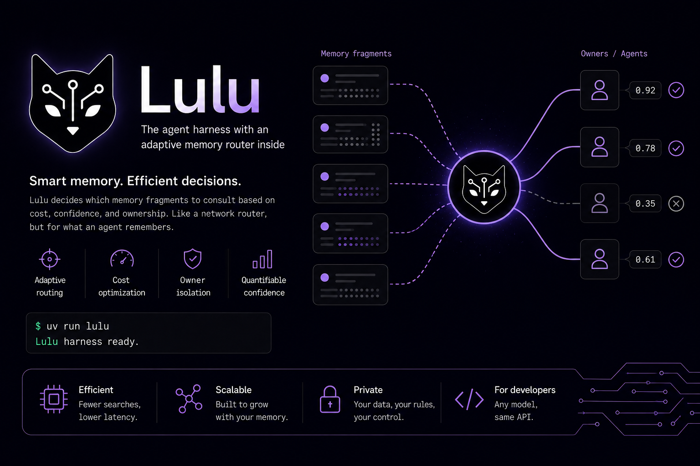
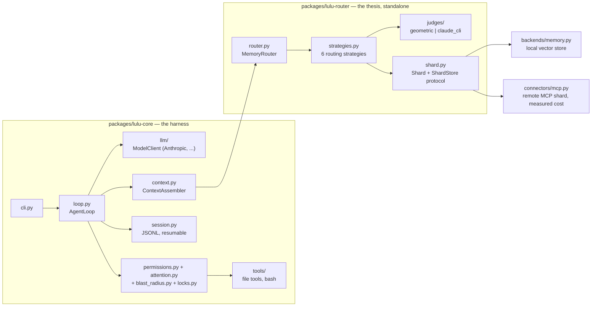

<p align="center">
  
</p>

<p align="center">
  <a href="https://github.com/Agostynah/lulu-harness/actions/workflows/ci.yml"></a>
  <a href="LICENSE"></a>
  
</p>

Lulu is an agent harness with an adaptive memory router at its core: instead
of searching *all* of an agent's memory on every turn, it decides *which*
shards are worth contacting based on cost, confidence, and who's allowed to
see them — the same way a network router picks a path, but for what an
agent remembers.

It exists to carry a research result into something real. The routing
strategies come from [distributed-vector-memory-routing](https://github.com/Agostynah/distributed-vector-memory-routing)
(DBpedia14, 100K docs — **42% less communication at 100% recall @ K=16**).
Lulu gives that thesis a real workload, real heterogeneous costs, and a
harness that actually runs. The full argument, with its falsification
criteria stated up front, is in **[docs/THESIS.md](docs/THESIS.md)**.

## Why sharding, not just a bigger index

A single-machine harness doesn't pay for network hops, so "why not just use
one flat index" is the obvious objection. It's wrong once you name the
actual scarce resource: **not network bytes — context tokens, latency, and
dollars.** A local SQLite shard costs ~5ms and $0 per query; an MCP-backed
remote shard costs ~800ms and real money. A flat index can't express "I'm
already confident from local shards, don't pay for the remote one" — once
everything is merged into one index, every result costs the same to fetch,
by construction. A router that tracks cost per shard and spends against an
explicit budget can.

Two more axes fall out of putting this in a harness, not just a benchmark:

- **Permission, not just performance.** `Shard.permits(scope)` means a
  subagent scoped to customer A can never retrieve customer B's memories —
  something a flat index cannot do *even in principle*, because merged
  vectors have nowhere to attach a boundary. The same mechanism protects
  against prompt-injected memory ever reaching a privileged context.
- **A judge that reads content, not just geometry.** The paper's confidence
  estimate (`sigmoid(gap) × coverage`) never looks at *what* came back. Lulu
  adds a second judge — a small model that reads the candidates and decides
  if they're actually enough — behind the same `Judge` protocol, so either
  one drives any of the six routing strategies interchangeably.

## Results (DBpedia14, K=16, geometric judge)

| strategy | recall@10 | shards contacted | communication saved |
|---|---|---|---|
| `query_all` (global baseline) | 1.00 | 16/16 | — |
| `confidence_threshold` | 0.99 | 10/16 | 38% |
| `budgeted_communication` (cap = K/2) | 0.98 | 8/16 | 50% |
| `top_n_neighbors` (n=3) | 0.85 | 3/16 | 81% |

Reported as a trade-off, not rounded up — full numbers, methodology, and the
two real bugs this eval caught (a mis-calibrated judge, a placeholder-content
bug) are in [`evals/dbpedia/README.md`](evals/dbpedia/README.md).

## Architecture

Two packages: the routing thesis, standalone and dependency-free of the
harness, and the harness that carries it.



`lulu-router` never imports the harness — it's tested and benchmarked
(`evals/dbpedia`) entirely on its own. `context.py` is the only file in
`lulu-core` that knows the router exists at all.

## Quick start

```bash
uv sync                          # core deps
uv run pytest                    # 235 tests, ubuntu/windows/macos in CI
uv run lulu "fix the typo in X"  # run the harness (needs an Anthropic key)
```

```bash
uv sync --group eval             # + fastembed/datasets, only for the eval below
uv run python evals/dbpedia/run.py
```

## Layout

```
packages/lulu-router/   the routing thesis — partitioning, strategies, judges
packages/lulu-core/     the harness — loop, tools, permissions, sessions, CLI
evals/                  reproducible experiments (not part of the test suite)
docs/THESIS.md          the argument, and how each claim gets falsified
```

## Testing

235 tests, all cross-platform (Linux/macOS/Windows in CI) — several caught
real, non-hypothetical bugs: a `glob("../x")` pattern that genuinely escapes
the project root, Windows silently corrupting line endings on every edit,
and backslash-based path traversal that Windows blocked but Linux didn't
until it was normalized. Security-relevant files (`permissions.py`,
`attention.py`, `blast_radius.py`, `locks.py`, `tools/sandbox.py`) get an
adversarial test, not just a happy-path one, as policy — see
**[CONTRIBUTING.md](CONTRIBUTING.md)** for the full expectations and how to
run everything.

## Roadmap

What's built, what's next, and why — kept in
**[ROADMAP.md](ROADMAP.md)** rather than cluttering this file.

## License

[MIT](LICENSE).
